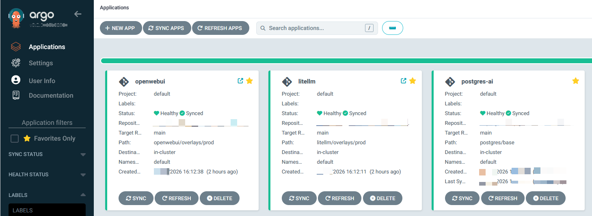

#  🚀 AI-Stack GitOps: LiteLLM + Open WebUI + Postgres

Este repositorio contiene la arquitectura completa para desplegar un stack de Inteligencia Artificial privado y escalable en **Kubernetes**. La gestión de la infraestructura se realiza mediante un modelo **GitOps** utilizando **ArgoCD** y **Kustomize**.


## 🏗️ Arquitectura del Sistema



El stack se compone de tres capas principales diseñadas para trabajar en armonía dentro del clúster:

1.  **Interfaz de Usuario (Frontend):** [Open WebUI](https://github.com/open-webui/open-webui), una interfaz intuitiva para interactuar con LLMs.
2.  **Orquestador de Modelos (Middleware):** [LiteLLM](https://github.com/BerriAI/litellm), que actúa como proxy para gestionar múltiples modelos y proveedores.
3.  **Persistencia (Backend):** Base de datos **PostgreSQL** para almacenar chats, usuarios y configuraciones.


## 🛠️ Tecnologías Utilizadas

* **Kubernetes (K3s):** Orquestación de contenedores.
* **ArgoCD:** CD declarativo para sincronización automática del estado deseado.
* **Kustomize:** Gestión de configuraciones por capas (Base y Overlays).
* **Traefik:** Ingress Controller para la gestión del tráfico externo y TLS.
* **Local Path Provisioner:** Persistencia de datos mediante volúmenes locales.

## 📁 Estructura del Repositorio

```text
.
├── argocd/             # Manifiestos de Application para ArgoCD (GitOps)
├── postgres/           # Base de datos (Deployment, Service, PVC)
├── litellm/            # Proxy de modelos con configuración Kustomize
└── openwebui/          # Interfaz web con Overlays para entorno Prod (Ingress/TLS)
```

## 🚀 Despliegue con GitOps

Este proyecto está diseñado para ser desplegado instantáneamente mediante ArgoCD.
1. Prerrequisitos

    Un clúster de Kubernetes funcionando (K3s recomendado).

    ArgoCD instalado en el namespace argocd.

2. Instalación

Para desplegar todo el stack, aplica los manifiestos de orquestación:

```bash
kubectl apply -f argocd/
```

ArgoCD se encargará de sincronizar los recursos en el orden correcto, gestionando las dependencias y asegurando que el estado del clúster coincida con este repositorio.

Con el cluster de postgresql activado, el ultimo paso de despliegue será generar la base de datos para OpenWeb UI: 

```bash
kubectl exec -it $(kubectl get pod -l app=postgres -o name) -- psql -U admin -d litellm -c "CREATE DATABASE openwebui_db;"
```

## 💡 Lecciones Aprendidas (Troubleshooting)

Durante el desarrollo, se resolvieron retos técnicos críticos, destacando:

    Persistencia Inmutable: Resolución de conflictos en la inmutabilidad de los PersistentVolumeClaims (PVC) al separar la gestión del almacenamiento de la lógica de aplicación en ArgoCD.

    GitOps Workflow: Migración de configuraciones estáticas a un flujo dinámico con Kustomize, permitiendo la reutilización de código entre bases y parches de producción.

    Seguridad de Secretos: Implementación de inyección de secretos en memoria para evitar la exposición de credenciales en el historial de Git.
